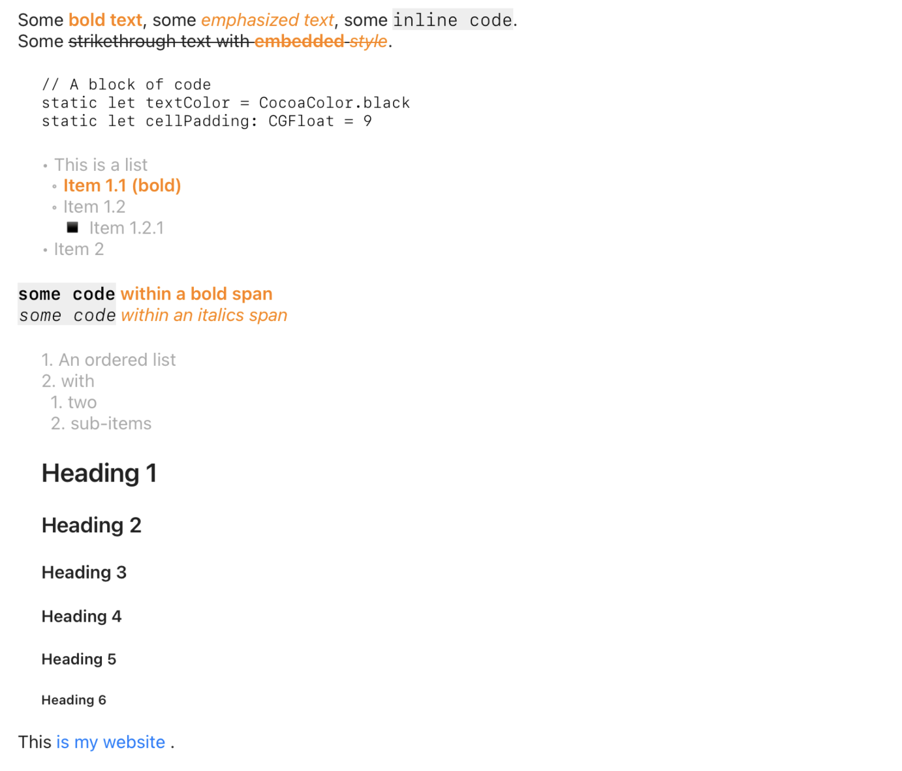

# MarkdownToAttributedString

A Swift package that converts Markdown content into an `NSAttributedString`, suitable for applying to Apple UI elements such as `UILabel`, `UITextView`, `NSTextField`, `NSTextView`, etc. `MarkdownToAttributedString` builds on top of Apple's own [Swift Markdown](https://github.com/swiftlang/swift-markdown) parser for maximum performance, consistency, and compatibility. While you can pretty easily accomplish this with the newer `AttributedString` options from Apple, these are only available in iOS 15+ and macOS 12+, yet many of us have apps targeting older OS versions.

## Compatibility
MarkdownToAttributedString works on all versions of iOS, macOS (_well, Mac OS X+, ha_), and watchOS.

## Supported Markdown Types

- [x] Strong
- [x] Emphasis
- [x] Strikethrough
- [x] Inline code
- [x] Code blocks
- [x] ATX headings
- [x] Setex headings
- [x] Links
- [x] Unordered lists
- [x] Ordered lists
- [ ] Tables
- [ ] Task lists (aka checkboxes)
- [ ] Images
- [ ] HTML


## Usage

### Basic Example

```swift
    import MarkdownToAttributedString

    @IBOutlet weak var someLabel: UILabel!

    let md = """
Some **bold text**, some *emphasized text*, some `inline code`.

Some ~~strikethrough text with **embedded** *style*~~.

\```
// A block of code
static let textColor = CocoaColor.black
static let cellPadding: CGFloat = 9
\```

* This is a list
    * **Item 1.1 (bold)**
    * Item 1.2
        * Item 1.2.1
* Item 2

**`some code` within a bold span**
*`some code` within an italics span*

1. An ordered list
1. with
    1. two
    1. sub-items

# Heading 1
## Heading 2
### Heading 3
#### Heading 4
##### Heading 5
###### Heading 6

This [is my website ](https://madebywindmill.com).

"""

    someLabel.attributedText = AttributedStringFormatter.format(markdown: md)
    
```

### Example With Custom Styling

```swift
    import MarkdownToAttributedString

    @IBOutlet weak var someLabel: UILabel!

    let md = ... // as above

    let indentedPStyle = NSMutableParagraphStyle()
    indentedPStyle.firstLineHeadIndent = 20
    indentedPStyle.headIndent = 20
    
    let baseAttrs: StringAttrs = [.font: UIFont.systemFont(ofSize: 15),
                                  .foregroundColor: UIColor(hex3: 0x222222)]
    let styleAttrs: [MarkupType: StringAttrs] = [
        .strong: [
            .font: UIFont.boldSystemFont(ofSize: 15),
            .foregroundColor: UIColor.orange
        ],
        .emphasis: [
            .font: UIFont.italicSystemFont(ofSize: 15),
            .foregroundColor: UIColor.orange
        ],
        .inlineCode: [
            .font: UIFont.monospacedSystemFont(ofSize: 15, weight: .light),
            .foregroundColor: UIColor.black,
            .backgroundColor: UIColor(hex3: 0xEEEEEE)
        ],
        .codeBlock: [
            .font: UIFont.monospacedSystemFont(ofSize: 13, weight: .light),
            .foregroundColor: UIColor.black,
            .paragraphStyle: indentedPStyle
        ],
        .listItem: [
            .font: UIFont.systemFont(ofSize: 15, weight: .regular),
            .foregroundColor: UIColor.lightGray
        ],
        .heading: [
            .font: UIFont.boldSystemFont(ofSize: 15),
            .paragraphStyle: indentedPStyle
        ],
        .unorderedList: [
            .font: UIFont.monospacedSystemFont(ofSize: 15, weight: .regular),
            .paragraphStyle: indentedPStyle
        ],
        .orderedList: [
            .font: UIFont.monospacedSystemFont(ofSize: 15, weight: .regular),
            .paragraphStyle: indentedPStyle
        ],
        .link: [
            .font: CocoaFont.systemFont(ofSize: 15, weight: .regular),
        ]
    ]
    
    let markdownStyles = MarkdownStyles(baseAttributes: baseAttrs, styleAttributes: styleAttrs)
    let formatter = AttributedStringFormatter(markdown: md, styles: markdownStyles)
    let attrStr = formatter.format()
    someLabel.attributedText = attrStr

```

### Result



## MIT License

Copyright (c) 2025 Made by Windmill, LLC

Permission is hereby granted, free of charge, to any person obtaining a copy of this software and associated documentation files (the "Software"), to deal in the Software without restriction, including without limitation the rights to use, copy, modify, merge, publish, distribute, sublicense, and/or sell copies of the Software, and to permit persons to whom the Software is furnished to do so, subject to the following conditions:

The above copyright notice and this permission notice shall be included in all copies or substantial portions of the Software.

THE SOFTWARE IS PROVIDED "AS IS", WITHOUT WARRANTY OF ANY KIND, EXPRESS OR IMPLIED, INCLUDING BUT NOT LIMITED TO THE WARRANTIES OF MERCHANTABILITY, FITNESS FOR A PARTICULAR PURPOSE AND NONINFRINGEMENT. IN NO EVENT SHALL THE AUTHORS OR COPYRIGHT HOLDERS BE LIABLE FOR ANY CLAIM, DAMAGES OR OTHER LIABILITY, WHETHER IN AN ACTION OF CONTRACT, TORT OR OTHERWISE, ARISING FROM, OUT OF OR IN CONNECTION WITH THE SOFTWARE OR THE USE OR OTHER DEALINGS IN THE SOFTWARE.
